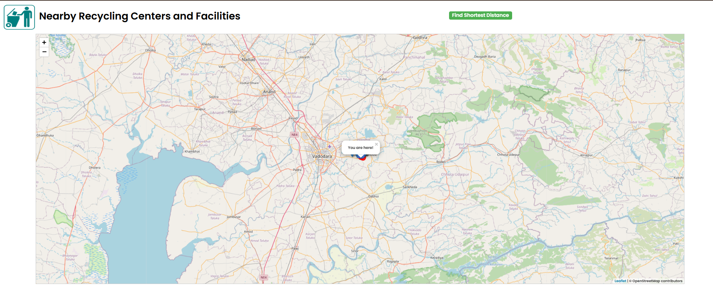
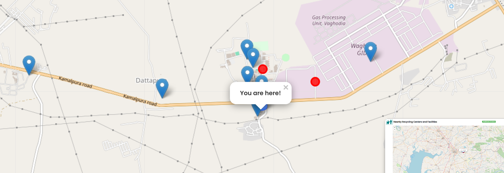
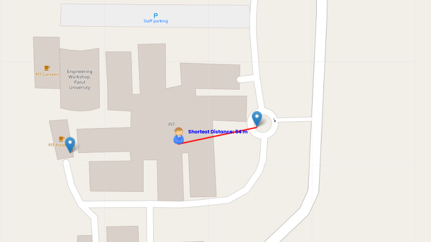

<h1>🚮 Dustbin 🔍 near me</h1>

##Overview
> This is one of the feature that I build during 2024 SIH hackathon where we are working on Waste Management system, as a software.
 ---

 ## Features
 - Also uses image for showing different dustbin around user
 - It uses API of openSteetMap to get location map
 - Have a button that shows nearest dustbin
 - It done using dummy data for dustbin

---

 **Screenshots**

---

***Tech Stack Used***
HTML, CSS and JavaScript used to build.
